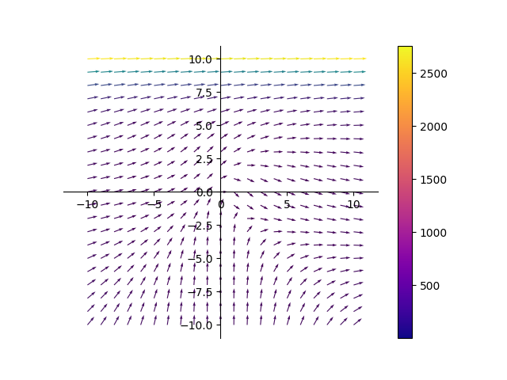
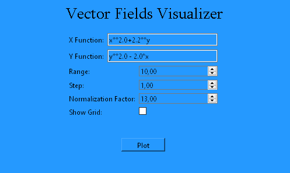

# Vector Fields Visualizer

## Table of Contents
- [About](#about)

## About 

Project I developed to learn more about Matplotlib and python GUIs, in this case about PyQt6. It can calculate vector fields and show them with Matplotlib on the fly with some custom parameters

